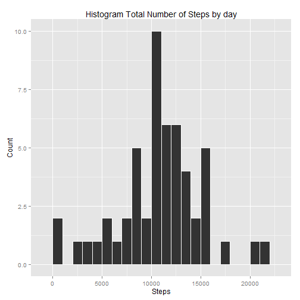
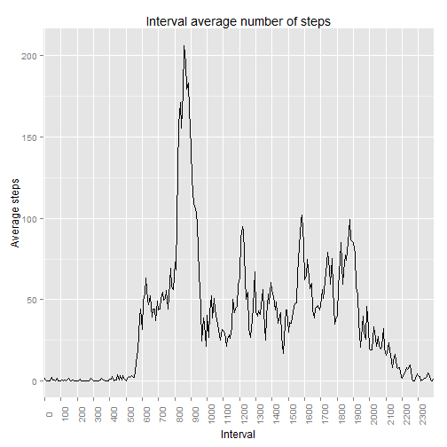
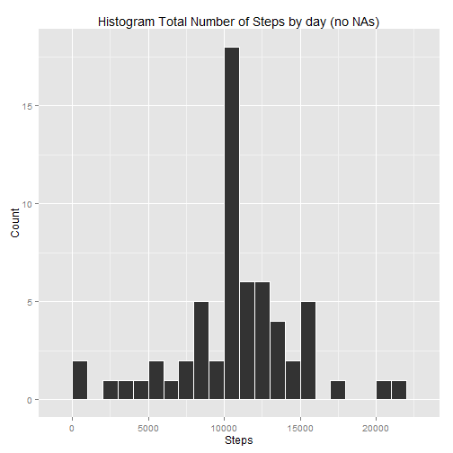
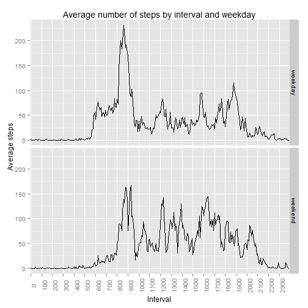

#Reproducible Research 
##Peer Assessment 1

#Assignement

###Initial setup

```r
setwd("C:/Users/Luis Mauricio/Dropbox/Para llevar/RepRes_Assignment 1")
library(dplyr)
library(ggplot2)
library(tidyr)
library(lubridate)
```

###Loading and preprocessing the data

1. Load the data

```r
datax<-read.csv("activity.csv")
```

2. Process/transform the data (if necessary) into a format suitable for your analysis.

No further transformations, just convert to factor certain variables.


```r
datax$intervalf<-as.factor(datax$interval)
datax$dated<-ymd(datax$date)
str(datax)
```

```
## 'data.frame':	17568 obs. of  5 variables:
##  $ steps    : int  NA NA NA NA NA NA NA NA NA NA ...
##  $ date     : Factor w/ 61 levels "2012-10-01","2012-10-02",..: 1 1 1 1 1 1 1 1 1 1 ...
##  $ interval : int  0 5 10 15 20 25 30 35 40 45 ...
##  $ intervalf: Factor w/ 288 levels "0","5","10","15",..: 1 2 3 4 5 6 7 8 9 10 ...
##  $ dated    : POSIXct, format: "2012-10-01" "2012-10-01" ...
```

```r
head(datax)
```

```
##   steps       date interval intervalf      dated
## 1    NA 2012-10-01        0         0 2012-10-01
## 2    NA 2012-10-01        5         5 2012-10-01
## 3    NA 2012-10-01       10        10 2012-10-01
## 4    NA 2012-10-01       15        15 2012-10-01
## 5    NA 2012-10-01       20        20 2012-10-01
## 6    NA 2012-10-01       25        25 2012-10-01
```

###What is mean total number of steps taken per day?
Note:Ignore missing data

1. Calculate the total number of steps taken per day


```r
byday<-group_by(datax,dated)
byday<-subset(byday,steps!="NA")
total_step<-summarise(byday,step_sum=sum(steps,na.rm=TRUE))
total_step
```

```
## Source: local data frame [53 x 2]
## 
##         dated step_sum
## 1  2012-10-02      126
## 2  2012-10-03    11352
## 3  2012-10-04    12116
## 4  2012-10-05    13294
## 5  2012-10-06    15420
## 6  2012-10-07    11015
## 7  2012-10-09    12811
## 8  2012-10-10     9900
## 9  2012-10-11    10304
## 10 2012-10-12    17382
## ..        ...      ...
```

2. Make a histogram of the total number of steps taken each day


```r
ggplot(data=total_step,aes(total_step$step_sum))+
        geom_histogram(col="white",binwidth=1000)+
        labs(title="Histogram Total Number of Steps by day") +
        labs(x="Steps", y="Count")
```

 

3. Calculate and report the mean and median of the total number of steps taken per day


```r
mean_step<-data.frame(mean=mean(total_step$step_sum),median=median(total_step$step_sum))
mean_step
```

```
##       mean median
## 1 10766.19  10765
```

###What is the average daily activity pattern?

1. Make a time series plot (i.e. type = "l") of the 5-minute interval (x-axis) and the average number of steps taken, averaged across all days (y-axis)


```r
byinterval<-group_by(datax,intervalf)
byinterval<-subset(byinterval,steps!="NA")
avg_step<-summarise(byinterval,step_avg=mean(steps,na.rm=TRUE))
ggplot(data=avg_step,aes(x=intervalf,y=step_avg,group=1))+geom_line()+
        theme(axis.text.x  = element_text(angle=90))+
        labs(title="Interval average number of steps") +
        labs(x="Interval", y="Average steps")+
        scale_x_discrete(breaks=seq(0,2355,100))
```

 

2. Which 5-minute interval, on average across all the days in the dataset, contains the maximum number of steps?

The 5-minute interval with the maximum number of steps on average is the one coded with the label "835" with an average number of steps of 206.16 steps.

```r
max_step<-max(avg_step$step_avg)
avg_step[which(avg_step$step_avg== max_step),]
```

```
## Source: local data frame [1 x 2]
## 
##   intervalf step_avg
## 1       835 206.1698
```

###Imputing missing values

1. Calculate and report the total number of missing values in the dataset (i.e. the total number of rows with NAs)

Number of missing values in steps variable:

```r
sum(is.na(datax$steps))
```

```
## [1] 2304
```

2. Devise a strategy for filling in all of the missing values in the dataset. The strategy does not need to be sophisticated. For example, you could use the mean/median for that day, or the mean for that 5-minute interval, etc.

I imput the missing values with the mean of steps by interval.


```r
datam<-merge(datax,avg_step,by="intervalf")
datamx<-mutate(datam,steps_narm=ifelse(is.na(steps),step_avg,steps))
```

3. Create a new dataset that is equal to the original dataset but with the missing data filled in.


```r
clone<-subset(datamx,select=c("steps_narm","dated","intervalf"))
```

4. Make a histogram of the total number of steps taken each day and Calculate and report the mean and median total number of steps taken per day. Do these values differ from the estimates from the first part of the assignment? What is the impact of imputing missing data on the estimates of the total daily number of steps?


```r
bydayx<-group_by(clone,dated)
total_stepx<-summarise(bydayx,step_sum=sum(steps_narm))

ggplot(data=total_stepx,aes(total_stepx$step_sum))+
        geom_histogram(col="white",binwidth=1000)+
        labs(title="Histogram Total Number of Steps by day (no NAs)") +
        labs(x="Steps", y="Count")
```

 

The mean does not change, but the median value is a little bit higher with the imputed values. (The first pair of values correspond to the imputed dataset mean and median, the second to the original dataset mean and median)

```r
mean_stepx<-data.frame(meanx=mean(total_stepx$step_sum),
                       medianx=median(total_stepx$step_sum))
mean_stepx
```

```
##      meanx  medianx
## 1 10766.19 10766.19
```

```r
mean_step
```

```
##       mean median
## 1 10766.19  10765
```

###Are there differences in activity patterns between weekdays and weekends?
Use weekdays() fucntion

1. Create a new factor variable in the dataset with two levels - "weekday" and "weekend" indicating whether a given date is a weekday or weekend day.

Note: I use the Sys.setlocale() function to change the language of the weekend() function from spanish to english.

```r
Sys.setlocale("LC_TIME", "English")
```

```
## [1] "English_United States.1252"
```

```r
clone$day<-factor(weekdays(clone$dated,abbreviate=TRUE))
clone_w<-mutate(clone,weekday=ifelse(day=="Sat" | day=="Sun",2,1))
clone_w$weekdayf<-factor(clone_w$weekday,levels=c(1,2),labels=c("weekday","weekend"))
```

2. Make a panel plot containing a time series plot (i.e. type = "l") of the 5-minute interval (x-axis) and the average number of steps taken, averaged across all weekday days or weekend days (y-axis). 


```r
byintervalx<-group_by(clone_w,intervalf,weekdayf)

avg_stepx<-summarise(byintervalx,step_avg=mean(steps_narm))
ggplot(data=avg_stepx,aes(x=intervalf,y=step_avg,group=1))+geom_line()+
        theme(axis.text.x  = element_text(angle=90))+
        facet_grid(weekdayf~.)+
        labs(title="Average number of steps by interval and weekday") +
        labs(x="Interval", y="Average steps")+
        theme(axis.text.x  = element_text(angle=90))+
        scale_x_discrete(breaks=seq(0,2355,100))
```

 

Export this file:  
library(knitr)  
knit2html("PA1_template.Rmd")


